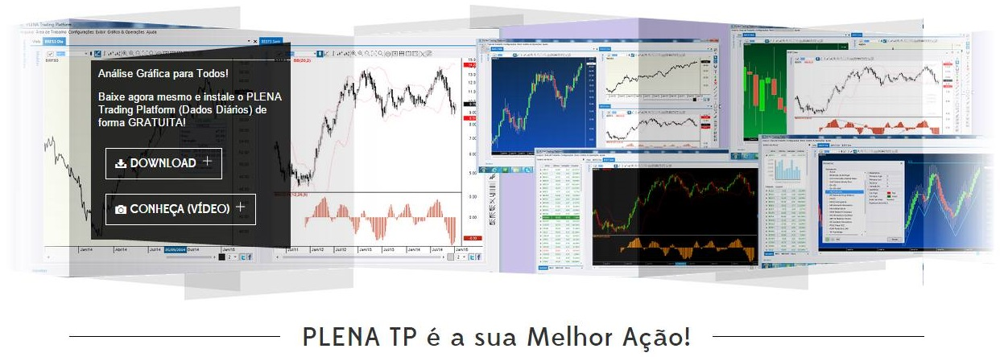

# Plena Trading Platform #
* [www.plena-tp.com.br](https://www.facebook.com/pg/plena.tp)

Plena Trading Platform is a simple and powerful tool for traders in stock market. It provides graphical analysis, back-testing, mathematical studies and customizable indicators on financial market.

### Platform Modules ###

* M4 Admin:
Web application with resources and administrative tools.
* M4 C# DDF:
Desktop application for distribution of Plena Trading Platform.
* DS Plena:
Data Service application for real time quotes and data syncronization.
* StockChartX:
Graphical core to render charts, indicators and mathematical studies.
* TradeScript:
Script library used for backtesting.
* Crainiate Open Diagram:
Open source visual tool to create visual diagrams.

### Stacks & Frameworks ###

* M4 Admin:
C#, ASP.NET, XML, WebServices, MS SQL.
* M4 C# DDF:
C#, Telerik, InstallShield, Dotfuscator.
* DS Plena:
C#, ASP.NET, MS SQL.
* StockChartX:
C++, ActiveX.
* TradeScript:
C#.
* Crainiate Open Source Diagram:
C#.

### Infra & DevOps ###

* Server Backend provisioned on Azure with pipeline hooked to TFS
* Desktop application manually built with InstallShield

### Demo ###

### Contribution guidelines ###

* Anyone and everyone is welcome to contribute.

### Contact ###

* [vinicius.silva.arruda@gmail.com](mailto:vinicius.silva.arruda@gmail.com)
